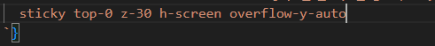
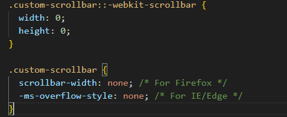

tomake sticky: overflow -y-auto etc and h-screen is cruicial
sticky top-0 z-30 h-screen overflow-y-auto


3.how to hide scrollbar attached by browser automatically
add custom-scrollbar class to the parent div
and then css
.custom-scrollbar::-webkit-scrollbar {
  width: 0;
  height: 0;
}

.custom-scrollbar {
  scrollbar-width: none; /* For Firefox */
  -ms-overflow-style: none; /* For IE/Edge */
}

```css